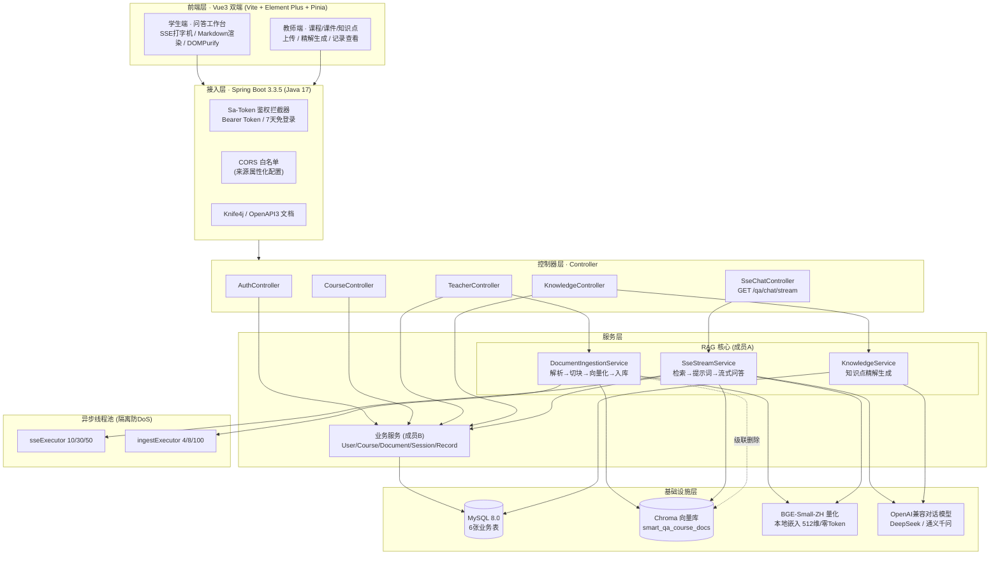
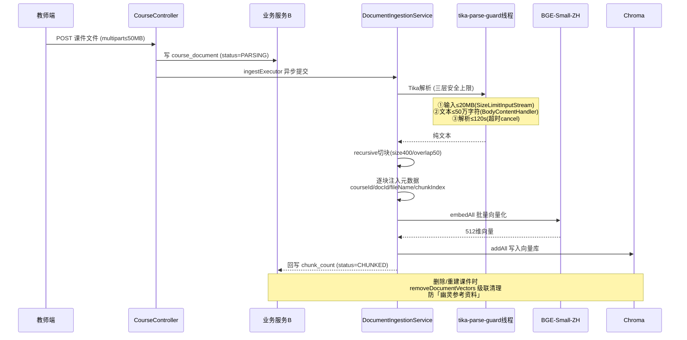
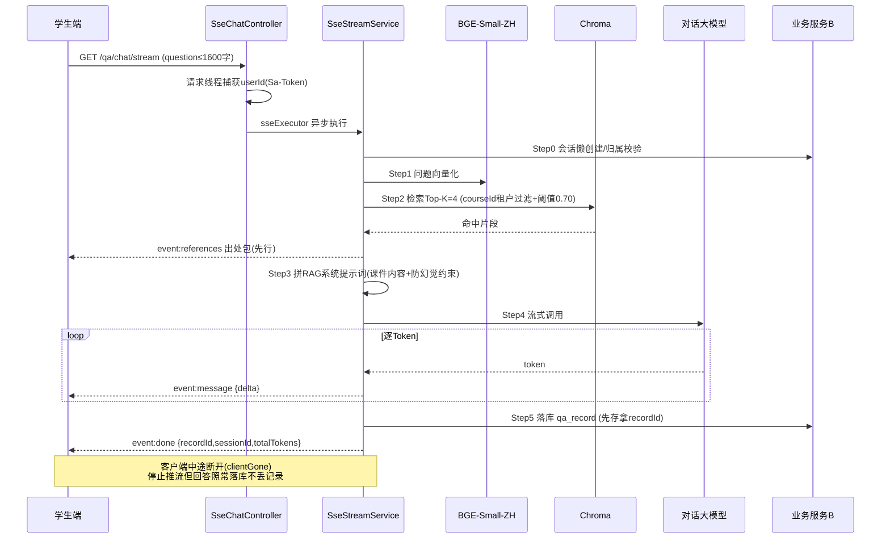
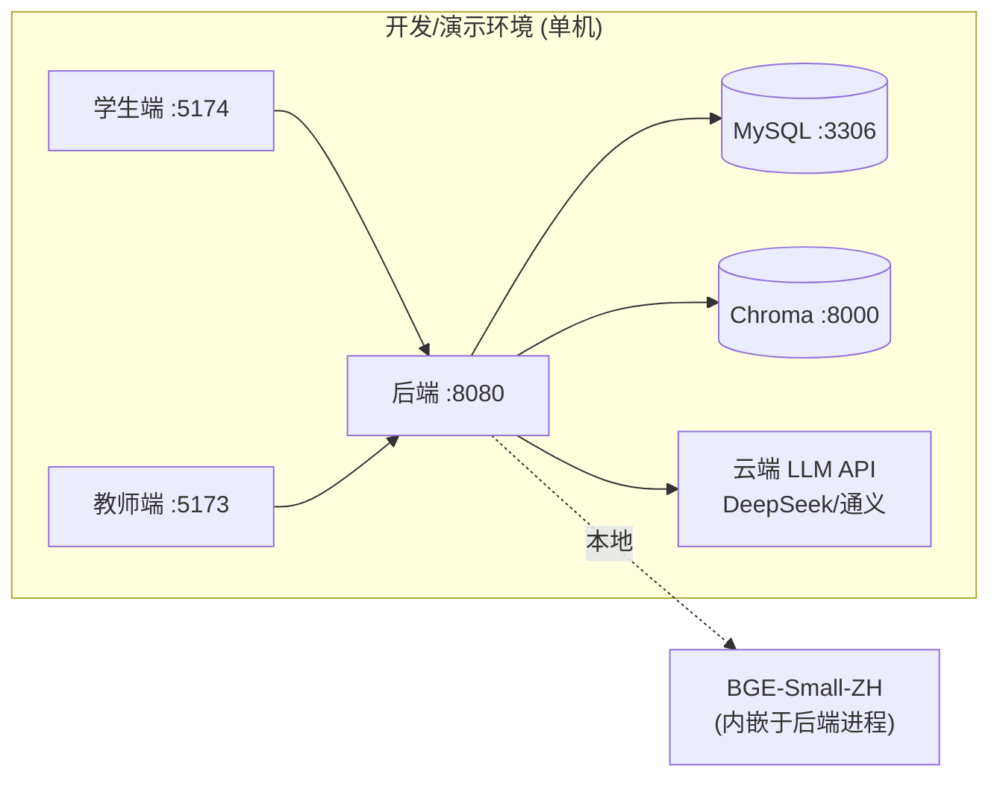

# A3.2 系统架构图与技术选型说明（答辩用）

> **用途**：第三周 A3.2 交付物，作为答辩「技术亮点陈述」与 D3.2 软件工程文档/PPT 的一手素材。
> **数据来源**：本文所有技术点均对照 dev 分支真实代码核实（pom.xml / application.yml / RAG 服务类 / schema.sql），非凭记忆罗列。
> **架构图**：采用 Mermaid，可在 GitHub、VS Code、Typora 直接渲染；导出 PPT 时渲染截图即可。
> **负责人**：组长 A ｜ **对应计划**：THREE_WEEK_PLAN.md A3.2

---

## 1. 系统定位

面向高校的 **AI 智能答疑辅导平台**：教师上传课程课件自动构建课程知识库，学生基于知识库获得**流式、可溯源**的智能答疑与知识点精解。核心价值是用 **RAG（检索增强生成）** 把大模型的回答约束在课程课件范围内，做到「答案有出处、不瞎编」。

**两类角色 · 两个独立前端**：

| 角色 | 前端 | 核心能力 |
|---|---|---|
| 教师 | frontend-teacher | 课程管理、课件上传（触发切块入库）、知识点精解生成与增删改、问答记录查看 |
| 学生 | frontend-student | 课程知识库问答（SSE 流式 + 出处溯源）、知识点列表浏览 |

---

## 2. 总体架构图

---

## 3. RAG 双链路数据流

### 3.1 入库链路（教师上传课件 → 构建知识库）

### 3.2 问答链路（学生提问 → 流式可溯源回答）

**SSE 事件契约**（DEV_SPECIFICATION 4.2 冻结，data 一律 JSON）：

| 事件 | 载荷 | 说明 |
|---|---|---|
| `references` | `[{docId,fileName,chunkIndex,score,snippet}]` | 流上第一个包，先出处后正文 |
| `message` | `{delta}` | 逐 Token 增量正文 |
| `done` | `{recordId,sessionId,finishReason,totalTokens}` | 结束包，必含 recordId |
| `error` | `{errorCode,message}` | 5001模型异常/5002落库失败/5000内部异常 |

---

## 4. 技术选型说明

### 4.1 后端与框架

| 技术 | 版本 | 选型理由 |
|---|---|---|
| Spring Boot | 3.3.5 | 主流企业级框架，生态成熟；3.x 基于 Jakarta EE 9+，与 LangChain4j、Sa-Token 的 Boot3 starter 对齐 |
| Java | 17 | LTS 版本，Spring Boot 3 最低要求 |
| MyBatis-Plus | 3.5.7 | 增强 CRUD 免写样板 SQL；内置逻辑删除（`is_deleted`）、驼峰映射，契合 6 表模型 |
| Sa-Token | 1.38.0 | 轻量国产鉴权，无状态 Token（Bearer），7 天免登录；比 Spring Security 上手快、配置直观 |
| Knife4j | 4.5.0 | OpenAPI3 在线接口文档，联调期 A/B/C/D 对接口即查即用；生产可 `SWAGGER_ENABLED=false` 关闭 |
| HikariCP | 内置 | Spring Boot 默认连接池，性能优；max 20 连接 |

### 4.2 RAG 与 AI（核心亮点）

| 技术 | 版本/规格 | 选型理由 |
|---|---|---|
| LangChain4j | 0.35.0 | Java 生态最成熟的 LLM 编排框架，提供 EmbeddingModel / ChatModel / EmbeddingStore / DocumentSplitter 全套抽象 |
| BGE-Small-ZH 量化 | ONNX，512维，~45MB | **嵌入模型本地化**：纯 CPU 运行、零 Token 费用、无远程依赖；中文检索效果好；随 jar 加载内存复用 |
| 对话大模型 | OpenAI 兼容端点 | **对话模型云端化**：可无缝切换 DeepSeek / 通义千问 / Ollama；temperature 0.2 求稳，max-tokens 1500 |
| Chroma | 向量库 | 轻量开源向量数据库，支持元数据过滤（courseId 租户隔离的关键）；**心跳探测失败自动降级 InMemory**，本地开发免装 |
| Apache Tika | 文档解析 | 统一解析 PDF/DOCX/TXT/MD 等多格式，提取纯文本供切块 |

> **「路线二」成本-能力平衡**：嵌入用本地 BGE（高频、量大、零成本），对话用云端大模型（低频、要能力）。既控制 Token 开销，又保证回答质量，且对话模型可插拔替换。

### 4.3 前端

| 技术 | 版本 | 选型理由 |
|---|---|---|
| Vue | 3.4.21 | 组合式 API，双端复用组件心智一致 |
| Vite | 5.1.6 | 极速冷启动与 HMR，开发体验好 |
| Element Plus | 2.6.1 | 成熟 Vue3 组件库，双端视觉基线统一（见 issue#43 约定） |
| Pinia | 2.1.7 | Vue3 官方状态管理，类型友好 |
| @microsoft/fetch-event-source | 2.0.1 | 支持带自定义请求头/中断控制的 SSE 客户端（原生 EventSource 不能带 Authorization 头） |
| markdown-it + highlight.js | 14.1 / 11.9 | 渲染 AI 的 Markdown 回答 + 代码高亮 |
| DOMPurify | 3.0.9 | **渲染前消毒，防 XSS**（AI 输出与课件内容均视为不可信） |
| TypeScript | 5.2.2 | 全量类型约束，`vue-tsc --noEmit` 纳入构建门禁 |

### 4.4 数据存储

| 存储 | 用途 | 关键设计 |
|---|---|---|
| MySQL 8.0 | 6 张业务表（用户/课程/课件/会话/记录/知识点） | 全表逻辑删除 `is_deleted`；`qa_record.grounding_references` 用 JSON 存出处快照 |
| Chroma | 课件切块向量 + 元数据 | collection `smart_qa_course_docs`；元数据 camelCase 键（courseId/docId/fileName/chunkIndex）与检索过滤严格一致 |

---

## 5. 关键架构决策（答辩亮点清单）

1. **RAG 检索增强，而非裸问大模型**：回答约束在课程课件内，`references` 出处包先行，做到可溯源、防幻觉。
2. **防幻觉提示词工程**：`RAG_SYSTEM_PROMPT` 明确要求「课件不足时补充学科常识必须显式标注【课外补充说明】」，区分「有据」与「推断」。
3. **本地嵌入 + 云端对话的路线二**：高频嵌入零 Token 成本，对话模型可插拔（DeepSeek/通义/Ollama）。
4. **courseId 租户级向量过滤**：检索时 `IsEqualTo("courseId", ...)` 硬过滤，从数据层杜绝跨课程串内容。
5. **双线程池隔离 + AbortPolicy**：`sseExecutor`（长挂流）与 `ingestExecutor`（CPU 密集切块）分池，避免互相饿死；拒绝策略用 Abort 而非 CallerRuns，**防止慢任务回落拖空 Tomcat 线程导致全站 DoS**。
6. **三层解析安全上限（M2 加固）**：输入 20MB / 文本 50 万字符 / 解析 120s 超时，独立 daemon 池限时，防解压炸弹与畸形文档拖垮切块线程。
7. **向量存储优雅降级**：Chroma 心跳探测（`/api/v2/heartbeat`，3s 超时）失败自动降级 InMemory，本地开发免装即可联调；生产强制 Chroma。
8. **SSE 断流仍落库**：客户端中途断开时 `clientGone` 标记停推流，但回答照常写入 `qa_record`，不丢历史记录。
9. **双写一致性 + 级联清理**：课件删除/重建时先 `removeDocumentVectors` 清 Chroma 再改 MySQL，防「幽灵参考资料」。
10. **登录态跨线程传递**：`@Async` 线程拿不到 Sa-Token 的 ThreadLocal，故 userId 由 Controller 在请求线程捕获后显式传入 SSE 服务。
11. **前端渲染安全**：DOMPurify 对 AI 输出与课件内容渲染前消毒，反 XSS；三态占位（失败>加载>空）+ 竞态守卫（recordsToken）保证健壮体验。
12. **全配置环境变量化**：数据库、AI 密钥、Chroma、CORS 来源均走 `${ENV:default}`，密钥不入库、按环境切换。

---

## 6. 部署拓扑与环境

**关键端口/参数**：后端 8080 ｜ MySQL 3306 ｜ Chroma 8000 ｜ 课件 multipart 上限 50MB ｜ 提问业务上限 1600 字 ｜ chunk 400/overlap 50/top-k 4/阈值 0.70。

**配置环境变量**（详见 `application.yml` 与 `.env.example`）：`MYSQL_*`、`AI_BASE_URL`、`AI_API_KEY`、`AI_CHAT_MODEL`、`CHROMA_HOST`、`CORS_ALLOWED_ORIGINS`、`SWAGGER_ENABLED`。

---

## 7. 数据模型概览（MySQL 6 表）

| 表 | 职责 | 关键字段 |
|---|---|---|
| `sys_user` | 用户 | username(学号/工号)、password(BCrypt)、role(STUDENT/TEACHER) |
| `course` | 课程 | course_name、course_code、teacher_id |
| `course_document` | 课件 | course_id、file_*、chunk_count、parse_status(PENDING/PARSING/CHUNKED/FAILED) |
| `qa_session` | 问答会话 | user_id、course_id、session_title |
| `qa_record` | 问答明细 | question、answer(LONGTEXT)、grounding_references(JSON)、feedback_rating、latency_ms |
| `course_knowledge_point` | 知识点库 | course_id、chapter_name、title、summary |

> 全表带 `is_deleted` 逻辑删除（MyBatis-Plus 全局配置），DDL 改动严禁漏列。

---

## 8. 答辩问答预案（评委高频追问）

- **Q：为什么用本地嵌入模型而不调 OpenAI embedding？**
  A：嵌入是高频、大批量操作，本地 BGE-Small-ZH 零 Token 成本、无网络依赖、数据不出域；512 维中文检索效果足够。对话才用云端大模型，成本与能力兼顾。

- **Q：RAG 怎么保证不「答非所问」或编造？**
  A：① 检索阶段 courseId 租户过滤 + 相似度阈值 0.70 双重收敛；② 提示词强制「课件不足须标注【课外补充说明】」；③ `references` 出处包回传原文片段，学生可核对溯源。

- **Q：高并发下会不会被大文件/慢请求拖垮？**
  A：双线程池物理隔离切块与问答；AbortPolicy 快速失败不回落 Tomcat 线程；三层解析上限（20MB/50万字/120s）拦住解压炸弹与畸形文档。

- **Q：Chroma 挂了系统还能用吗？**
  A：启动时心跳探测，不可达自动降级 InMemory 保证可用（仅开发态，重启丢数据）；生产环境强制依赖 Chroma 持久化。

- **Q：向量库和 MySQL 数据会不会不一致？**
  A：课件删除/重建走「先清向量、再改库」的级联清理，`removeDocumentVectors` 按 docId 删净所有切块，杜绝幽灵引用。

---

*文档结束。如图需导出为 PPT 用的视觉美化版总览图，可另行处理；本文 Mermaid 已可直接渲染为专业框图。*
